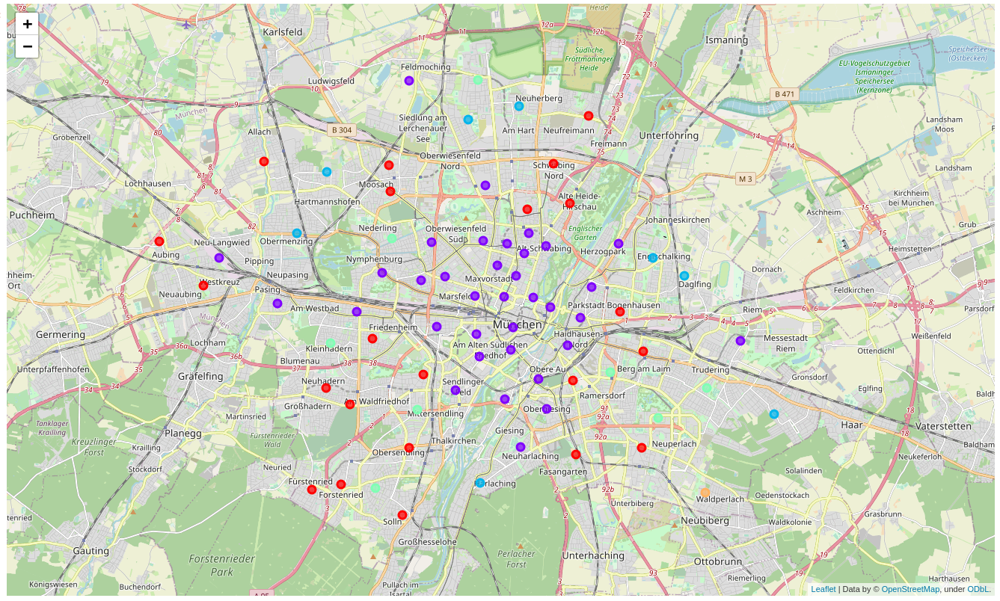

### Report

# Capstone Project - The Battle of Neighborhoods

Matthäus Morhart
  
March 2021

## Introduction

Munich is the capital of bavaria. It is a global centre of:

- art
- science
- technology
- finance
- publishing
- culture
- innovation
- education
- business
- tourism

Because of these attributes a friend of mine decided moving to munich. He asked me helping him choosing the right district to live in.


## Data

### Data Sources
The first dataset is from [https://www.dasoertliche.de](https://www.dasoertliche.de/Themen/Postleitzahlen/M%C3%BCnchen.html).

Including:

- postal code
- town name
- district
- borough
- state


```python
import pandas as pd 

url = 'https://www.dasoertliche.de/Themen/Postleitzahlen/M%C3%BCnchen.html'
df = pd.read_html(url, flavor='bs4')[0]

df.head()
```
|PLZ|Ortsname|Ortsteil|Landkreis|Bundesland|
|---|--------|--------|---------|----------|
|80331 	|München 	|AltstadtIsarvorstadtLehelLudwigsvorstadt 	  |Stadt München 	|Bayern|
|80333 	|München 	|AltstadtMaxvorstadtSchwabing-West 	          |Stadt München 	|Bayern|
|80335 	|München 	|AltstadtLudwigsvorstadtMaxvorstadtNeuhausen 	|Stadt München 	|Bayern|
|80336 	|München 	|AltstadtIsarvorstadtLudwigsvorstadtSendling 	|Stadt München 	|Bayern|
|80337 	|München 	|IsarvorstadtLudwigsvorstadtSendling 	        |Stadt München 	|Bayern|

The next code creates a new column *location*.
```python
df['location'] = df.Bundesland + ', ' + df.Ortsname + ', ' + df.PLZ.astype(str)
```
Possible output of column *location*:

`Bayern, München, 80331`

With *Nominatim* through the library *geopandas* we will get the centered geographical coordinates of districts.

```python
import geopandas as gpd

user_agent = 'coursera_capstone_munich'

gdf = gpd.tools.geocode(df.location, provider='nominatim', user_agent=user_agent)
```
|geometry|address|
|--------|-------|
|POINT (11.57344 48.13606)|Altstadt-Lehel, München, Bayern, 80331, Deutschland|

Get the venues from *Foursquare API* searching by coordinates.

With this data we will create a map and information chart of clusters to solve the problem.

### Data Cleaning

The following rows were selected by including *Stadt München* and excluding *Flughafen-München*.

```python
df = df.loc[df.Landkreis == 'Stadt München']
df = df.loc[~(df.Ortsname == 'München-Flughafen')].reset_index(drop=True)
```

## Methodology

After merging all dataframes and using OneHotEncoder to binarize the venues categories, we used *KMeans* from *sklearn.cluster* to cluster the entries into 5 clusters.

This made the following clusters in decreasing order:

|Cluster Labels    |   1 |   0 |   2 |   3 |   4 |
|:---------------|----:|----:|----:|----:|----:|
| n |  35 |  22 |   8 |   8 |   1 |


## Results

### Information chart of clusters



| Cluster | 0 | 1 | 2 | 3 | 4 |
|:--------|--:|--:|--:|--:|--:|
| color   |red|puprle|blue|torquoise|orange|

You can see the clusters in the following tables. 

### Postal Codes for Cluster 0 - RED

|    |   PLZ | address                                                                                                               |
|---:|------:|:----------------------------------------------------------------------------------------------------------------------|
|  0 | 80686 | Laim, München, Bayern, 80686, Deutschland                                                                             |
|  1 | 80804 | Schwabing-West, München, Bayern, 80804, Deutschland                                                                   |
|  2 | 80805 | Bezirksteil Alte Heide - Hirschau, Schwabing-Freimann, München, Bayern, 80805, Deutschland                            |
|  3 | 80807 | München, Bayern, 80807, Deutschland                                                                                   |
|  4 | 80939 | Bezirksteil Freimann, Schwabing-Freimann, München, Bayern, 80939, Deutschland                                         |
|  5 | 80992 | Moosach, München, Bayern, 80992, Deutschland                                                                          |
|  6 | 80993 | Moosach, München, Bayern, 80993, Deutschland                                                                          |
|  7 | 80999 | Bezirksteil Untermenzing-Allach, Allach-Untermenzing, München, Bayern, 80999, Deutschland                             |
|  8 | 81243 | Bezirksteil Aubing-Süd, Aubing-Lochhausen-Langwied, München, Bayern, 81243, Deutschland                               |
|  9 | 81249 | Bezirksteil Altaubing, Aubing-Lochhausen-Langwied, München, Bayern, 81249, Deutschland                                |
| 10 | 81373 | Bezirksteil Mittersendling, Sendling-Westpark, München, Bayern, 81373, Deutschland                                    |
| 11 | 81375 | Hadern, München, Bayern, 81375, Deutschland                                                                           |
| 12 | 81377 | Hadern, München, Bayern, 81377, Deutschland                                                                           |
| 13 | 81379 | Bezirksteil Obersendling, Thalkirchen-Obersendling-Forstenried-Fürstenried-Solln, München, Bayern, 81379, Deutschland |
| 14 | 81475 | Thalkirchen-Obersendling-Forstenried-Fürstenried-Solln, München, Bayern, 81475, Deutschland                           |
| 15 | 81476 | Bezirksteil Forstenried, Thalkirchen-Obersendling-Forstenried-Fürstenried-Solln, München, Bayern, 81476, Deutschland  |
| 16 | 81479 | Bezirksteil Solln, Thalkirchen-Obersendling-Forstenried-Fürstenried-Solln, München, Bayern, 81479, Deutschland        |
| 17 | 81549 | Obergiesing-Fasangarten, München, Bayern, 81549, Deutschland                                                          |
| 18 | 81669 | Bezirksteil Ramersdorf, Ramersdorf-Perlach, München, Bayern, 81669, Deutschland                                       |
| 19 | 81673 | Berg am Laim, München, Bayern, 81673, Deutschland                                                                     |
| 20 | 81677 | Bezirksteil Parkstadt, Bogenhausen, München, Bayern, 81677, Deutschland                                               |
| 21 | 81737 | Bezirksteil Altperlach, Ramersdorf-Perlach, München, Bayern, 81737, Deutschland                                       |


### Postal Codes for Cluster 1 -  PURPLE

|    |   PLZ | address                                                                                 |
|---:|------:|:----------------------------------------------------------------------------------------|
|  0 | 80331 | Altstadt-Lehel, München, Bayern, 80331, Deutschland                                     |
|  1 | 80333 | Maxvorstadt, München, Bayern, 80333, Deutschland                                        |
|  2 | 80335 | Maxvorstadt, München, Bayern, 80335, Deutschland                                        |
|  3 | 80336 | Ludwigsvorstadt-Isarvorstadt, München, Bayern, 80336, Deutschland                       |
|  4 | 80337 | Ludwigsvorstadt-Isarvorstadt, München, Bayern, 80337, Deutschland                       |
|  5 | 80339 | Schwanthalerhöhe, München, Bayern, 80339, Deutschland                                   |
|  6 | 80469 | Ludwigsvorstadt-Isarvorstadt, München, Bayern, 80469, Deutschland                       |
|  7 | 80538 | Altstadt-Lehel, München, Bayern, 80538, Deutschland                                     |
|  8 | 80539 | Maxvorstadt, München, Bayern, 80539, Deutschland                                        |
|  9 | 80634 | Neuhausen-Nymphenburg, München, Bayern, 80634, Deutschland                              |
| 10 | 80636 | Neuhausen-Nymphenburg, München, Bayern, 80636, Deutschland                              |
| 11 | 80637 | Neuhausen-Nymphenburg, München, Bayern, 80637, Deutschland                              |
| 12 | 80639 | Neuhausen-Nymphenburg, München, Bayern, 80639, Deutschland                              |
| 13 | 80687 | Laim, München, Bayern, 80687, Deutschland                                               |
| 14 | 80796 | Schwabing-West, München, Bayern, 80796, Deutschland                                     |
| 15 | 80797 | Schwabing-West, München, Bayern, 80797, Deutschland                                     |
| 16 | 80798 | Maxvorstadt, München, Bayern, 80798, Deutschland                                        |
| 17 | 80799 | Maxvorstadt, München, Bayern, 80799, Deutschland                                        |
| 18 | 80801 | Schwabing-West, München, Bayern, 80801, Deutschland                                     |
| 19 | 80802 | Bezirksteil Schwabing - Ost, Schwabing-Freimann, München, Bayern, 80802, Deutschland    |
| 20 | 80803 | Bezirksteil Münchener Freiheit, Schwabing-Freimann, München, Bayern, 80803, Deutschland |
| 21 | 80809 | Milbertshofen-Am Hart, München, Bayern, 80809, Deutschland                              |
| 22 | 80995 | Bezirksteil Feldmoching, Feldmoching-Hasenbergl, München, Bayern, 80995, Deutschland    |
| 23 | 81241 | Bezirksteil Pasing, Pasing-Obermenzing, München, Bayern, 81241, Deutschland             |
| 24 | 81245 | Bezirksteil Altaubing, Aubing-Lochhausen-Langwied, München, Bayern, 81245, Deutschland  |
| 25 | 81371 | Sendling, München, Bayern, 81371, Deutschland                                           |
| 26 | 81539 | Obergiesing-Fasangarten, München, Bayern, 81539, Deutschland                            |
| 27 | 81541 | Au-Haidhausen, München, Bayern, 81541, Deutschland                                      |
| 28 | 81543 | Untergiesing-Harlaching, München, Bayern, 81543, Deutschland                            |
| 29 | 81547 | Untergiesing-Harlaching, München, Bayern, 81547, Deutschland                            |
| 30 | 81667 | Au-Haidhausen, München, Bayern, 81667, Deutschland                                      |
| 31 | 81675 | Bezirksteil Altbogenhausen, Bogenhausen, München, Bayern, 81675, Deutschland            |
| 32 | 81679 | Bezirksteil Altbogenhausen, Bogenhausen, München, Bayern, 81679, Deutschland            |
| 33 | 81829 | Trudering-Riem, München, Bayern, 81829, Deutschland                                     |
| 34 | 81925 | Bezirksteil Herzogpark, Bogenhausen, München, Bayern, 81925, Deutschland                |

### Postal Codes for Cluster 2 -  BLUE

|    |   PLZ | address                                                                                           |
|---:|------:|:--------------------------------------------------------------------------------------------------|
|  0 | 80935 | Bezirksteil Hasenbergl-Lerchenau Ost, Feldmoching-Hasenbergl, München, Bayern, 80935, Deutschland |
|  1 | 80937 | Milbertshofen-Am Hart, München, Bayern, 80937, Deutschland                                        |
|  2 | 80997 | Bezirksteil Untermenzing, Allach-Untermenzing, München, Bayern, 80997, Deutschland                |
|  3 | 81247 | Bezirksteil Obermenzing, Pasing-Obermenzing, München, Bayern, 81247, Deutschland                  |
|  4 | 81545 | Untergiesing-Harlaching, München, Bayern, 81545, Deutschland                                      |
|  5 | 81827 | Trudering-Riem, München, Bayern, 81827, Deutschland                                               |
|  6 | 81927 | Bezirksteil Englschalking, Bogenhausen, München, Bayern, 81927, Deutschland                       |
|  7 | 81929 | Bezirksteil Daglfing, Bogenhausen, München, Bayern, 81929, Deutschland                            |

### Postal Codes for Cluster 3 - TURQUOISE

|    |   PLZ | address                                                                                                        |
|---:|------:|:---------------------------------------------------------------------------------------------------------------|
|  0 | 80638 | Neuhausen-Nymphenburg, München, Bayern, 80638, Deutschland                                                     |
|  1 | 80689 | Laim, München, Bayern, 80689, Deutschland                                                                      |
|  2 | 80933 | Bezirksteil Hasenbergl-Lerchenau Ost, Feldmoching-Hasenbergl, München, Bayern, 80933, Deutschland              |
|  3 | 81369 | Bezirksteil Mittersendling, Sendling-Westpark, München, Bayern, 81369, Deutschland                             |
|  4 | 81477 | Bezirksteil Solln, Thalkirchen-Obersendling-Forstenried-Fürstenried-Solln, München, Bayern, 81477, Deutschland |
|  5 | 81671 | Berg am Laim, München, Bayern, 81671, Deutschland                                                              |
|  6 | 81735 | Bezirksteil Neuperlach, Ramersdorf-Perlach, München, Bayern, 81735, Deutschland                                |
|  7 | 81825 | Trudering-Riem, München, Bayern, 81825, Deutschland                                                            |

### Postal Code for Cluster 4 -  ORANGE

|    |   PLZ | address                                                                          |
|---:|------:|:---------------------------------------------------------------------------------|
|  0 | 81739 | Bezirksteil Waldperlach, Ramersdorf-Perlach, München, Bayern, 81739, Deutschland |


## Discussion


## Conclusion
